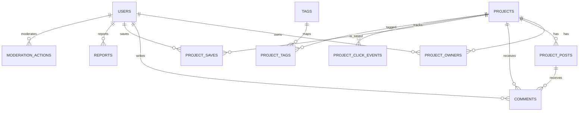

# 데이터 모델과 API 계약

## 1. 데이터 모델 개요

핵심 엔티티는 아래와 같다.

- users
- project_owners
- projects
- project_posts
- comments
- project_saves
- project_click_events
- tags
- project_tags
- reports
- moderation_actions

## 2. 관계도



## 3. 엔티티 상세

### 3-1. users

```txt
id
email
display_name
avatar_url
github_username
role(member/admin)
created_at
```

설명:

- 저장, member-authored feedback, 관리자 액션의 주체다.
- 댓글은 인증 사용자와 visitor guest 모두 남길 수 있다.
- 프로젝트 등록은 비회원도 가능하지만, 상호작용은 사용자 엔티티와 연결된다.

### 3-2. project_owners

```txt
id
project_id
user_id(nullable)
verification_method(email/github)
email_hash(nullable)
claim_token_hash
claim_token_expires_at(nullable)
is_primary
claimed_at(nullable)
created_at
```

설명:

- 프로젝트 소유권을 관리한다.
- 비회원 등록도 커버해야 하므로 `user_id`는 nullable이다.
- MVP는 별도 `submissions` 테이블 없이 `/submit` 성공 시 owner row를 즉시 생성한다.

### 3-3. projects

```txt
id
slug
title
tagline
short_description
overview_md
problem_md
target_users_md
why_made_md
stage(alpha/beta/live)
category
platform
pricing_model(free/freemium/paid/custom)
pricing_note
live_url
github_url
demo_url
docs_url
maker_alias
cover_image_url
gallery_json
is_open_source
no_signup_required
is_solo_maker
ai_tools_json
verification_state(unverified/github_verified/domain_verified)
status(pending/published/limited/hidden/rejected/archived)
published_at
last_activity_at
created_at
updated_at
```

설명:

- 서비스의 핵심 공개 엔티티다.
- 카드, 상세, 탐색, SEO 모두 이 테이블을 기준으로 한다.
- `pending`은 owner 확인 전 또는 예외적 자동 보호 hold 상태를 뜻하며, 관리자 사전 승인 대기 의미로 쓰지 않는다.

### 3-4. project_posts

```txt
id
project_id
author_user_id
type(launch/update/feedback)
title
summary
body_md
requested_feedback_md
media_json
status
created_at
published_at
```

설명:

- 프로젝트 하위 활동 이력이다.
- `author_user_id`는 owner, member, admin 중 실제 작성자를 가리킨다.
- `feedback`은 owner의 피드백 요청과 member의 구조화 피드백을 모두 이 활동 타입으로 관리한다.

### 3-5. comments

```txt
id
project_id
post_id(nullable)
parent_id(nullable)
user_id(nullable)
guest_name(nullable)
guest_session_hash(nullable)
body_md
status(active/hidden/deleted)
created_at
```

설명:

- 1단계 대댓글까지만 허용한다.
- `post_id`는 특정 활동 문맥에 연결할 때 사용한다.
- member 댓글은 `user_id`를 사용한다.
- visitor 댓글은 `guest_name`과 `guest_session_hash`를 사용하며, CAPTCHA와 더 강한 rate limit을 전제로 한다.

### 3-6. project_saves

```txt
user_id
project_id
created_at
```

설명:

- 북마크 성격의 저장 관계다.
- 랭킹과 개인 저장 목록에 사용한다.

### 3-7. project_click_events

```txt
id
project_id
source(home_card/detail_try/detail_github/etc)
session_hash
user_id(nullable)
created_at
```

설명:

- 실제 체험 유도 지표를 수집한다.
- 같은 세션의 반복 클릭 중복 카운트를 줄이기 위해 `session_hash`가 필요하다.

### 3-8. tags

```txt
id
slug
name
```

### 3-9. project_tags

```txt
project_id
tag_id
```

### 3-10. reports

```txt
id
reporter_user_id(nullable)
target_type(project/post/comment)
target_id
reason
note
status(open/reviewed/resolved/rejected)
created_at
```

### 3-11. moderation_actions

```txt
id
admin_user_id
target_type
target_id
action
reason
metadata_json
created_at
```

## 4. 인덱스 권장안

- `projects.slug` unique
- 정규화된 `live_url` unique partial
- 정규화된 `github_url` partial
- `projects(status, published_at desc)`
- `projects(last_activity_at desc)`
- 전문 검색 인덱스
  - `title`
  - `tagline`
  - `short_description`
- `project_posts(project_id, published_at desc)`
- `comments(project_id, created_at desc)`

## 5. URL 정규화 메모

중복 감지를 위해 아래는 정규화가 필요하다.

- protocol 차이 제거
- trailing slash 정리
- querystring 불필요 파라미터 제거
- GitHub URL 형식 통일

## 6. API 설계 원칙

- 공개 조회와 작성 API를 분리한다.
- 프로젝트 중심 REST 설계를 우선 사용한다.
- 작성 API는 소유권 확인 또는 자동 보호 상태를 반환할 수 있어야 한다.
- API 응답은 카드와 상세 렌더링에 필요한 최소 필드를 포함해야 한다.

## 7. 공개 조회 API

### `GET /api/projects`

목적:

- 홈 또는 탐색용 프로젝트 목록 조회

예시 쿼리:

```txt
/api/projects?sort=trending&tag=web&stage=beta&page=1
```

예시 응답:

```json
{
  "items": [
    {
      "id": "proj_123",
      "slug": "focus-flow",
      "title": "Focus Flow",
      "tagline": "회의 없이 할 일을 정리하는 AI 업무 보드",
      "coverImageUrl": "https://cdn.example.com/focus-flow.png",
      "makerAlias": "min",
      "stage": "beta",
      "badges": ["Web", "No Signup", "Beta"],
      "stats": {
        "comments": 12,
        "saves": 34
      },
      "urls": {
        "detail": "/p/focus-flow",
        "live": "https://focusflow.app"
      }
    }
  ],
  "pagination": {
    "page": 1,
    "pageSize": 20,
    "hasNext": true
  }
}
```

### `GET /api/projects/:slug`

목적:

- 프로젝트 상세 조회

예시 응답:

```json
{
  "id": "proj_123",
  "slug": "focus-flow",
  "title": "Focus Flow",
  "tagline": "회의 없이 할 일을 정리하는 AI 업무 보드",
  "overviewMd": "팀의 흩어진 할 일을 ...",
  "problemMd": "작은 팀은 회의와 메신저 사이에 ...",
  "targetUsersMd": "소규모 팀과 프리랜서를 위한 ...",
  "whyMadeMd": "직접 겪은 병목 때문에 만들었다.",
  "stage": "beta",
  "pricingModel": "freemium",
  "makerAlias": "min",
  "verificationState": "github_verified",
  "noSignupRequired": true,
  "isOpenSource": false,
  "links": {
    "liveUrl": "https://focusflow.app",
    "githubUrl": "https://github.com/example/focus-flow"
  },
  "media": {
    "coverImageUrl": "https://cdn.example.com/focus-flow.png",
    "gallery": []
  }
}
```

### `GET /api/projects/:slug/activity`

- 프로젝트 활동 목록 조회

### `GET /api/tags`

- 태그 목록 조회

### `GET /api/search?q=`

- 통합 검색

## 8. 등록/수정 API

### `POST /api/submissions/project`

목적:

- Launch 제출

예시 요청:

```json
{
  "type": "launch",
  "title": "Focus Flow",
  "tagline": "회의 없이 할 일을 정리하는 AI 업무 보드",
  "shortDescription": "작은 팀을 위한 AI 업무 보드",
  "liveUrl": "https://focusflow.app",
  "githubUrl": "https://github.com/example/focus-flow",
  "makerAlias": "min",
  "stage": "beta",
  "category": "productivity",
  "platform": "web",
  "verificationMethod": "email"
}
```

예시 응답:

```json
{
  "projectId": "proj_123",
  "status": "awaiting_claim",
  "nextAction": "verify_email"
}
```

구현 기준:

- 성공 응답은 `projects`, 초기 `project_posts(type=launch)`, provisional `project_owners` row가 이미 생성됐다는 뜻이다.
- 필수값 검증 실패, URL 형식 오류, 정규화 URL 중복이면 아무 레코드도 만들지 않고 에러를 반환한다.
- MVP는 별도 submission 레코드를 저장하지 않는다.

### `POST /api/submissions/verify-email`

- 매직링크 발송 또는 검증 처리

### `POST /api/submissions/verify-github`

- GitHub 검증 처리

### `PATCH /api/projects/:id`

- 프로젝트 기본 정보 수정

### `POST /api/projects/:id/posts`

- `Update`는 owner/admin만 추가
- `feedback`은 authenticated member 이상이 추가

## 9. 상호작용 API

### `POST /api/projects/:id/save`

- 저장 추가

### `DELETE /api/projects/:id/save`

- 저장 취소

### `POST /api/projects/:id/comments`

- member 댓글 또는 visitor guest 댓글 생성
- visitor는 `guestName`과 CAPTCHA 토큰이 필요하다.

예시 요청:

```json
{
  "body": "온보딩 첫 화면이 조금 길게 느껴졌어요.",
  "guestName": "early-user"
}
```

### `POST /api/comments/:id/replies`

- 1단계 대댓글 생성

### `POST /api/reports`

- 신고 생성

### `POST /api/projects/:id/outbound-click`

예시 요청:

```json
{
  "source": "detail_try",
  "sessionHash": "sess_abcd1234"
}
```

## 10. 관리자 API

### `GET /api/admin/moderation/queue`

- 신고 및 운영 이슈 큐 조회

### `POST /api/admin/moderation/action`

예시 요청:

```json
{
  "targetType": "project",
  "targetId": "proj_123",
  "action": "hide",
  "reason": "운영 정책 위반 또는 스팸 의심"
}
```

### `POST /api/admin/projects/:id/feature`

- 메인 추천 편성

### `POST /api/admin/projects/:id/archive`

- 보관 처리

## 11. 에러 응답 원칙

에러는 최소 아래 정보를 가진다.

```json
{
  "error": {
    "code": "VALIDATION_ERROR",
    "message": "liveUrl is required"
  }
}
```

## 12. 다음 확장 문서 후보

이 문서 다음 단계로는 아래가 자연스럽다.

- SQL DDL 문서
- 상세 OpenAPI 스펙
- search filter enum 확정
- DTO와 enum 단일 소스 문서
